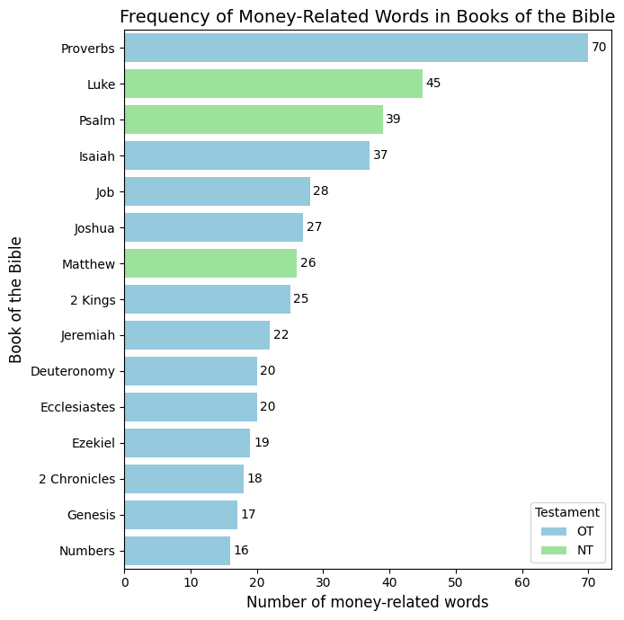

# money-in-bible
Analysis of Wealth and Money terms in the Bible

## Process
* This project uses the Berean Bible (https://bereanbible.com/) because of its free licensing nature
* The text is then processed into a Pandas Dataframe
* After this, simple mapping is performed to flag each verse for containing money-related words
* This is then aggregated by book and visualized

## Initial Output

## Future ideas
* Use Natural Language Processing to capture which verses / passages speak about money-related themes instead of exact words / phrases
